# Operating Systems (UE24CS242B) - Orange Problem (Unit 4)

## Overview

This repository contains a working implementation of PES-VCS, a small local version control system built in C. It stores file contents as hashed objects, builds trees from staged files, records commit history, and updates branch references through a HEAD pointer.

## Changes

The implementation is split across four core source files:

- `object.c` --> stores and reads content-addressed objects with integrity checks
- `tree.c` --> builds tree objects from the staged index
- `index.c` --> loads, saves, and updates the staging area
- `commit.c` --> creates commits and updates repository history

The result follows a simplified Git workflow:

1. `pes add` --> stores file data in the object database and updates the index.
2. `pes commit` --> builds a tree from the index and writes a commit object.
3. `pes log` --> walks the commit chain through the branch reference.

## Build And Test

```bash
make
make test_objects
make test_tree
make test-integration
```

The implementation was verified with the object tests, tree tests, and the full integration sequence.

## Screenshots

### Phase 1

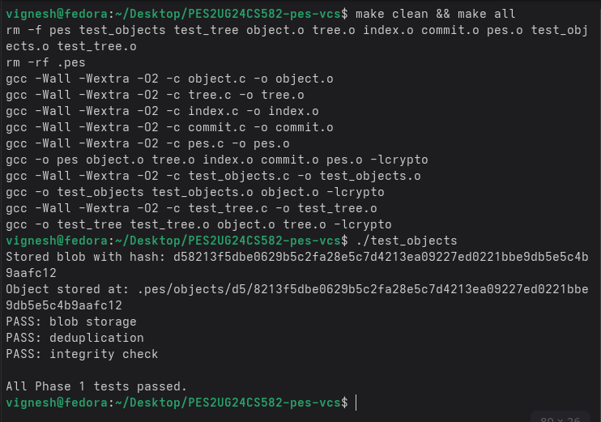

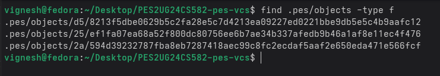

### Phase 2

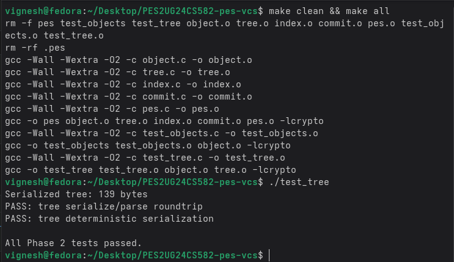

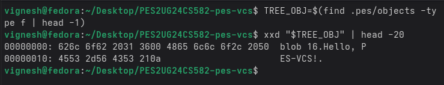

### Phase 3

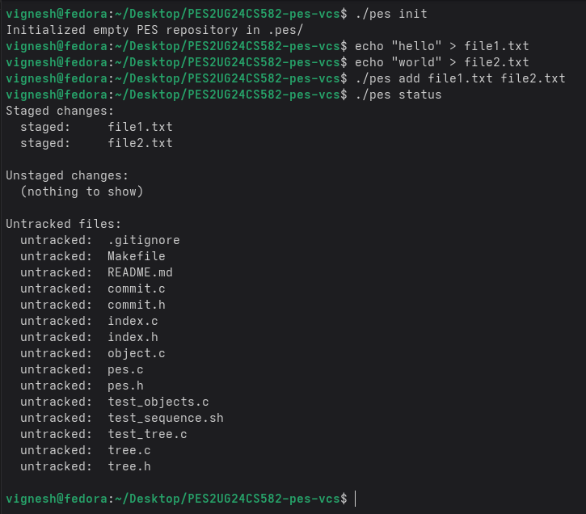

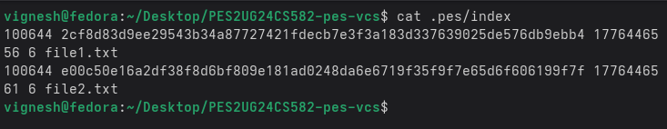

### Phase 4

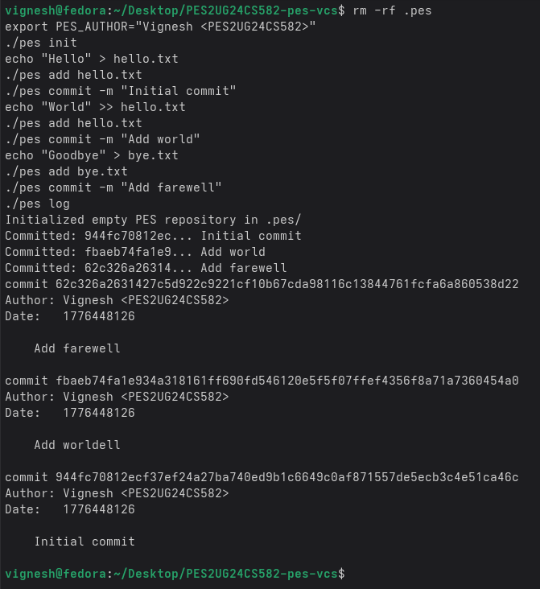

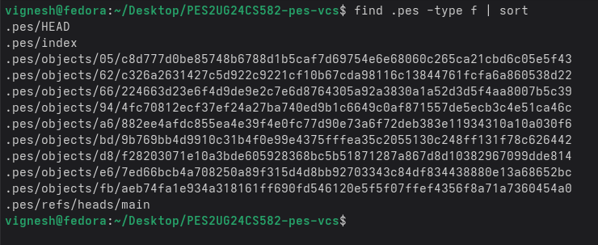

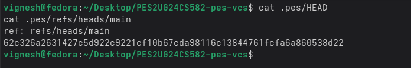

### Final

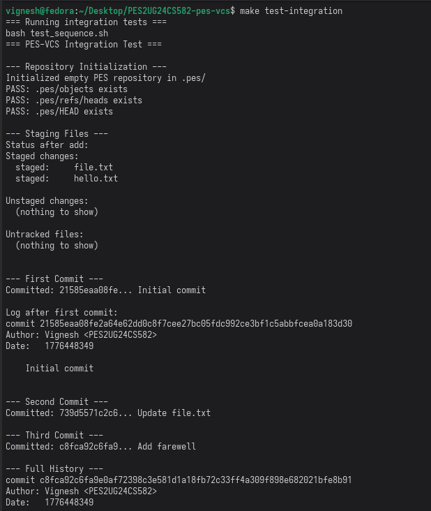

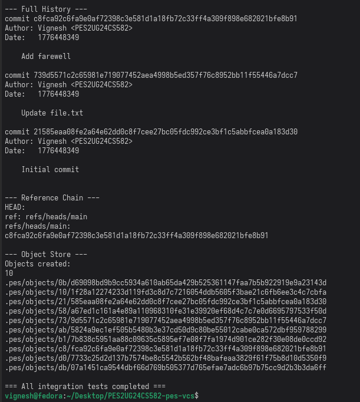


## Analysis Answers

### Q5.1 — How would you implement `pes checkout <branch>`?

If we want to build a `pes checkout <branch>` command, we basically need to change the working directory files to match the commit snapshot of the branch we are switching to. To do this, pes would first look inside `.pes/refs/heads/<branch>` to find the commit hash. Then it would change the `.pes/HEAD` file to point to our newly selected branch.

Once it finds the commit object, it traverses its trees and replaces the contents of the files in our current working directory with the files from the tree, deleting any files that shouldn't exist in the new branch. `.pes/index` also has to be updated to match. The trickiest part of all this is making sure we don't accidentally overwrite any local changes that the user hasn't committed yet.

### Q5.2 — Detecting a "Dirty Working Directory" Conflict

To prevent losing uncommitted work, we essentially need to compare three things. 
- 1st, we calculate the hashes of our current working directory files and compare them with what's stored in `.pes/index` (or check size/mtime). This tells us if the user has modified anything locally. 
- 2nd, we compare the tree belonging to our current branch against the tree of the branch we want to check out. This shows us what files will be changed by the checkout command itself. 
- 3rd, we look for an intersection --> if there is a file that the user edited locally, AND that same file is scheduled to be changed by the checkout process, we have a conflict. In this scenario, we just show an error message and abort the checkout.

### Q5.3 — Detached HEAD State

A "Detached HEAD" is basically when your `.pes/HEAD` file points to a raw commit hash directly, instead of referencing a branch like `refs/heads/main`. If the user decides to create a commit while in this state, the new commit will be created successfully and point to its parent, but it won't be attached to any branch reference. So if the user switches to another branch, those new commits will be left floating out in the void. To actually recover them, all you have to do is create a new branch pointer at that specific commit hash using `pes branch <name> <hash>`.

### Q6.1 — Garbage Collection Algorithm

We can build a simple Garbage Collector by using a "mark-and-sweep" algorithm. 
- 1st we trace downwards starting from all branch reference heads, traversing through parent commits, and reading all their corresponding tree and blob objects. As we visit each object, we add its hash to a fast lookup hash-set to mark it as active.
- After tracing everything, we run a sweep: we go through every single file in the `.pes/objects/` folder, checking each file's hash against our hash-set. If it isn't in the list, we simply delete it to free up disk space.
- For a repo holding 100k commits and 50 branches, since branches share parent histories, we would traverse roughly 100k commit files plus a couple hundred thousand tree and blob files depending on file additions.

### Q6.2 — GC Race Condition with Concurrent Commit

Running GC concurrently with a commit can ruin the repository. For instance, imagine a user runs `pes commit`. The system first creates new blob and tree objects in the `.pes/objects/` directory. But before the system can actually hook those objects up to a commit and update the branch reference, the Garbage Collector kicks in. The GC will look at those new blobs, realize no branch is pointing to them yet, and instantly delete them. The commit operation then finishes by writing a commit object that points to deleted data, corrupting the repository. Git fixes this by temporarily ignoring new objects (using a prune grace period of 2 weeks) and using lock files (`.lock`) to prevent processes from modifying refs at the same time.
